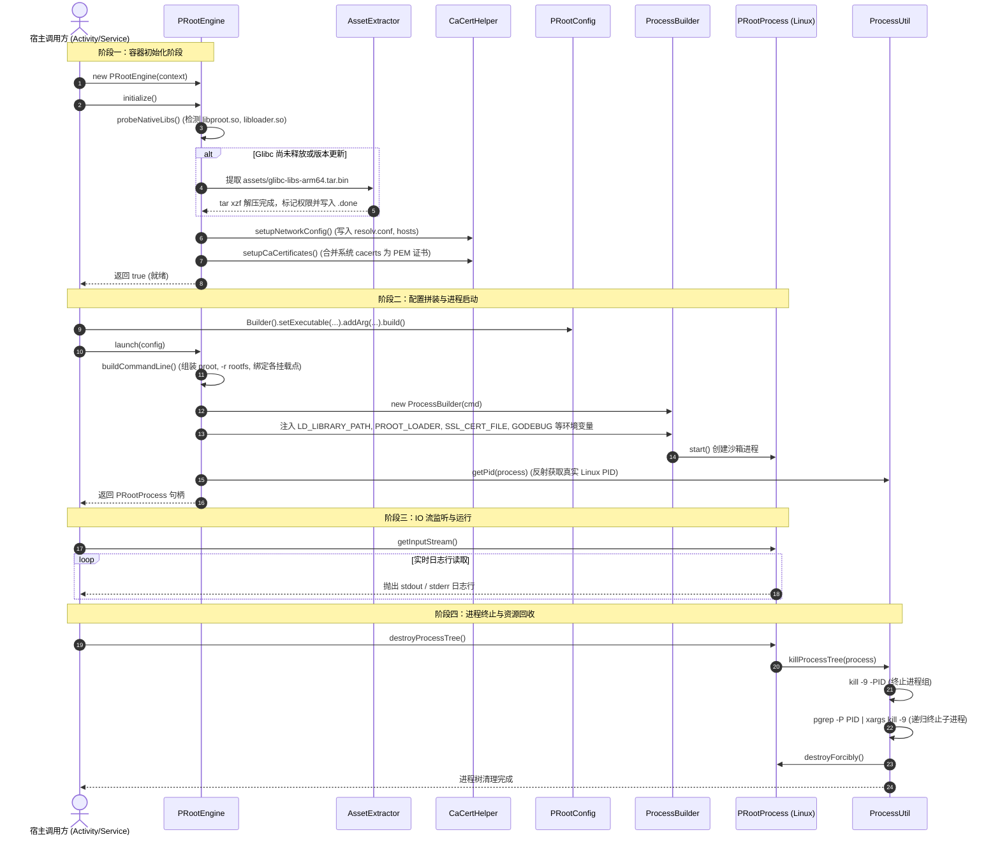

# Android-PRoot-Engine: 核心执行时序与生命周期

本文档详尽梳理从 Android 宿主调用 `PRootEngine` 到 Linux 二进制启动、日志流转与安全销毁的完整执行时序。

---

## 一、端到端时序总览 (Sequence Diagram)

---

## 二、各阶段核心步骤拆解

### 阶段 1：原生探针与定位 (`probeNativeLibs`)
1. 首先探测 `context.getApplicationInfo().nativeLibraryDir` 下是否存在 `libproot.so` 与 `libloader.so`；
2. 如果存在架构变体（如 ABI 目录命名为 `arm64` 或 `arm64-v8a`），引擎自动轮询替代候选路径：
   - `nativeLibraryDir.replace("arm64", "arm64-v8a")`
   - `nativeLibraryDir.replace("arm64-v8a", "arm64")`
   - `dataDir + "/lib/arm64-v8a"`
   - `dataDir + "/lib"`
3. 若缺少动态链接器，自动回落使用 Glibc 目录下的 `/lib/ld-linux-aarch64.so.1`；
4. 探测到 `libbash.so` 则自动将其挂载为 `/bin/sh`。

### 阶段 2：离线 Glibc 运行时就绪 (`setupGlibcLibs`)
1. 检查 `$glibcDir/usr/lib64/libc.so.6` 与标记文件 `$glibcDir/.done` 是否存在；
2. 若缺失，从 assets 中流式读取 `glibc-libs-arm64.tar.bin`（约 4.7MB）至临时文件；
3. 调用系统原生 `tar xzf` 高速释放到 `$glibcDir`；
4. 递归设置 `$glibcDir/usr/lib64` 下动态库为全局可读（`setReadable(true, false)`）；
5. 递归设置 `$glibcDir/usr/bin` 下二进制为可执行；
6. 写入 `.done` 校验就绪标记。

### 阶段 3：Rootfs 虚拟骨架与网络证书合成 (`setupRootfs`)
1. 快速创建根目录骨架：`lib`, `usr/lib64`, `usr/local/bin`, `tmp`, `app`, `dev`, `proc`, `sys`, `etc` 等；
2. **DNS 配置写入**：在 `etc/resolv.conf` 中写入内置的抗污染高可用公共 DNS 服务器（223.5.5.5, 119.29.29.29, 114.114.114.114, 8.8.8.8, 1.1.1.1）；
3. **CA 根证书合成**：遍历 Android 系统目录 `/system/etc/security/cacerts` 下的所有系统预置 CA 证书，统一拼接并转储为标准 PEM 格式：`etc/ssl/certs/ca-certificates.crt`。

### 阶段 4：命令行构建与环境注入 (`launch`)
1. **组装 proot 参数**：
   - `-r <rootfsDir>`：将虚拟目录作为 Linux 根目录 `/`；
   - `--link2symlink`：处理 Android FAT/FUSE 文件系统不支持硬链接的问题；
   - `--root-id`：伪造用户凭证，使得应用程序视角下 `uid=0, gid=0`（模拟 root 权限）；
   - `--cwd=<workDir>`：设定运行起始工作目录（默认 `/app`）；
   - `-b`：批量绑定主机关键设备节点与 Glibc 动态链接器。
2. **注入运行环境变量**：
   - `LD_LIBRARY_PATH`：指向应用原生库目录；
   - `PROOT_LOADER`：指向 `libloader.so` 路径；
   - `TMPDIR`：指向 `/tmp`；
   - `HOME`：指向 `/app`；
   - `GODEBUG=netdns=go`：**关键参数**，强制 Go 语言运行时使用纯 Go 编写的 DNS 解析器，完美兼容 Android 域名解析；
   - `SSL_CERT_FILE=/etc/ssl/certs/ca-certificates.crt`：指定标准 HTTPS 根证书位置。

### 阶段 5：进程树深度反射查杀 (`destroyProcessTree`)
1. 普通的 `java.lang.Process.destroy()` 仅能向主线程发送信号，无法波及 PRoot 内部派生的多层级子进程与后台 Daemon；
2. `ProcessUtil.getPid(process)` 跨 Android 7.0~15+ 深度反射提取物理 Linux PID；
3. 执行 `kill -9 -PID` 发送 SIGKILL 到该 PID 所在的进程组；
4. 执行 `pgrep -P PID | xargs kill -9` 递归扫描下挂的所有孤儿/子进程；
5. 最后调用 `android.os.Process.killProcess(pid)` 与 `process.destroyForcibly()` 彻底释放内核句柄。
